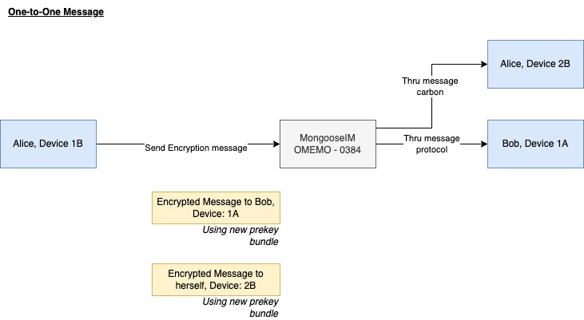
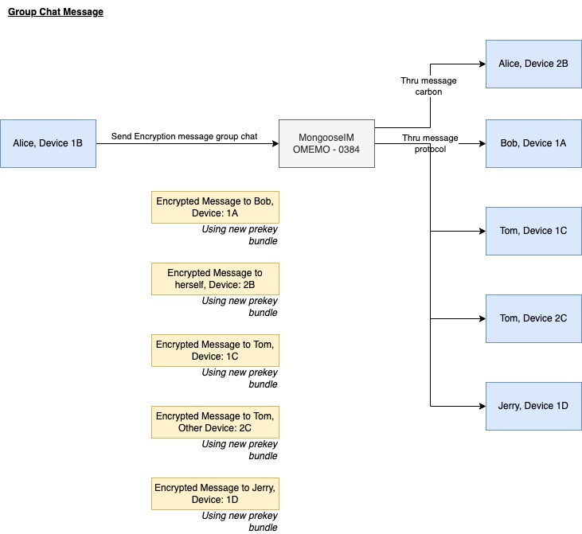

Library for Axololt Signal/Omemo-like encryption 
## Features

- Generate identifer key-pair
- Generate prekey list
- Generate signed key
- Generate last resort prekeys


## Getting started

### How personal chat end-to-end encryption




### How group chat end-to-end encryption



TODO: List prerequisites and provide or point to information on how to
start using the package.

TODO: improve group chat - create interface to fit the OMEMO end-to-end encryption:

I think I have read again, to comply with OMEMO multi-device-end to end encryption, we need to follow signal guide on the group end to end encryption, https://signal.org/blog/private-groups/ 

We need to handle it the same as 1-1, using different prekey for different group members and send N messages (per 1 session message) to N members using OMEMO xep protocol. I would have have to improve to manage session state to keep track of pre key and session for each user/group.

But the above implementation is only from whatsapp white  paper  https://scontent.whatsapp.net/v/t39.8562-34/271639644_1080641699441889_2201546141855802968_n.pdf/WhatsApp_Security_Whitepaper.pdf?ccb=1-5&_nc_sid=2fbf2a&_nc_ohc=PLXsX2a9-J0AX84iQt4&_nc_ht=scontent.whatsapp.net&oh=01_AVwKBcZxxD_xh8v6mJj6V7rM0By0Fzl6ceVBZZfiYCOj5Q&oe=62060AFE page 10)

My previous works:

- Understand the group end to end encryption work: https://www.reddit.com/r/signal/comments/a2ogk2/this_is_how_signal_protocol_encrypts_group/
- Whatsapp implementation white paper: https://scontent.whatsapp.net/v/t39.8562-34/271639644_1080641699441889_2201546141855802968_n.pdf/WhatsApp_Security_Whitepaper.pdf?ccb=1-5&_nc_sid=2fbf2a&_nc_ohc=PLXsX2a9-J0AX84iQt4&_nc_ht=scontent.whatsapp.net&oh=01_AVwKBcZxxD_xh8v6mJj6V7rM0By0Fzl6ceVBZZfiYCOj5Q&oe=62060AFE (Page 10)
- Have not fully verified with implementation: but check the audit report: https://conversations.im/omemo/audit.pdf
Summary points on the implementation:

The first time a WhatsApp group member sends a message to a group:

1. The sender generates a random 32-byte Chain Key.
2. The sender generates a random Curve25519 Signature Key
key pair.
3. The sender combines the 32-byte Chain Key and the public key from
the Signature Key into a Sender Key message.
4. The sender individually encrypts the Sender Key to each
member of the group, using the pairwise messaging protocol explained
previously.

For all subsequent messages to the group:

1. The sender derives a Message Key from the Chain Key, and updates
the Chain Key.
2. The sender encrypts the message using AES256 in CBC mode.
3. The sender signs the ciphertext using the Signature Key.
4. The sender transmits the single ciphertext message to the server, which
does server-side fan-out to all group participants.

The “hash ratchet” of the message sender’s Chain Key provides forward
secrecy. Whenever a group member leaves, all group participants clear their
Sender Key and start over.

In Chat Device Consistency information is included when distributing a
“Sender Key” and then excluded from the subsequent messages encrypted
with the Sender Key

## Usage

### Implement storage for your application

You should extend and implement the storage of the `storage/storage_interface.dart` which you could do:

- Init keys
- Store local identity, prekey, registration id, session
- Load back session, registration id, local identity key 

### Generate the first key for your first install of application of the user (or relogin)

```dart

import 'package:lib_omemo_encrypt/lib_omemo_encrypt.dart';

void main() {
    final axolotl = Axolotl();
    final alicekeyPackage = await axolotl.generatePreKeysPackage(preKeys);
    // ... next codes

```

As Alice, you can init your storage with the new keys and publish to server:

```dart


    // ..
    final aliceStore = MemoryStorage(
      localRegistrationId: alicekeyPackage.registrationId,
      localIdentityKeyPair: alicekeyPackage.identityKeyPair,
    );
    // Store your local pre keys
    aliceStore.setLocalPreKeyPair(alicekeyPackage.preKeys);
    // Publish your key to server based on your implementation
    // Let's say bob will fetch it


```

Bob fetch the keys from server and try to create session to catch

```dart

    // as bob, you init your own  keys

    final bobKeyPackage = await axolotl.generatePreKeysPackage(preKeys);
    final bobStore = MemoryStorage(
      localRegistrationId: bobKeyPackage.registrationId,
      localIdentityKeyPair: bobKeyPackage.identityKeyPair,
    );
    // Store your local pre keys
    bobStore.setLocalPreKeyPair(bobKeyPackage.preKeys);

    // You fetch alice key from server
    final bobReceivingPreKeyPublic = alicePreKey_fromServer;
    final bobReceivingSignKey = aliceSignedPreKey_fromServer;
    final bobReceivingIdentityKey = aliceSignedIdentityKey_fromServer;
    final signature = aliceSignature_fromServer;

    // Alice set key for Bob # use key 0
    const aliceUserId = 'alice@example.co'; // From server (e.g. in chat app you can fetch their id based on your implementation)
    final bobReceivingBundle = ReceivingPreKeyBundle(
        userId: aliceUserId,
        identityKey: bobReceivingIdentityKey,
        preKey: bobReceivingPreKeyPublic,
        signedPreKey: bobReceivingSignKey,
        signature: signature);


```

As bob, you are ready to create session:

```dart

    // Bob try to init the first cipher session
    final bobSessionFactory = SessionFactory(store: bobStore);
    var bobSession = await bobSessionFactory
        .createSessionFromPreKeyBundle(bobReceivingBundle);

    final bobCipherSession = SessionCipher();

    // Bob can encrypt message and set new session state
    final encryptedMsg = await bobCipherSession.encryptMessage(
        senderSession, Utils.convertStringToBytes('Hello Alice'));
    // Important to set back the latest session
    bobSession = encryptedMsg.session;


```

Now as Alice, you are receiving the prekey whisper message from bob:

```dart

    
    final aliceSessionFactory = SessionFactory(store: aliceStore);
    final aliceCipherSession = SessionCipher();

    Session _aliceSession = Session();
    // Encrypted message from Bob
    if (encryptedMsg.isPreKeyWhisperMessage) {

        // You can session from prekey whisper message
        final _ciperSession =
            await aliceSessionFactory.createSessionFromPreKeyWhisperMessage(
                _aliceSession, encryptedMsg.body);
        // Important to set back the latest session
        _aliceSession = _ciperSession.session;

        final decrypedMessage = await aliceCipherSession
            .decryptPreKeyWhisperMessage(_aliceSession, encryptedMsg.body);

        Log.instance.d(tag, 'Plain text: ${utf8.decode(decrypedMessage.plainText)}');
    } else {
    }

```

Now as Alice, you can want to send back the message to Bob:


```dart

    // Alice can encrypt message from session to 
    final encryptedMsg = await aliceCipherSession.encryptMessage(
        senderSession, Utils.convertStringToBytes('Hi Bob'));
    // Important to set back the latest session
    _aliceSession = encryptedMsg.session;

```

And now Bob, you receive the message from Alice.
You receive it as non-prekey whisper message.

```dart

    // Encrypted message from Alice
    if (encryptedMsg.isPreKeyWhisperMessage == false) {
        final decrypedMessage = await bobCipherSession
            .decryptWhisperMessage(bobSession, encryptedMsg.body);
        // Important to set back the latest session
        bobSession = decrypedMessage.session;

        Log.instance.d(tag, 'Plain text: ${utf8.decode(decrypedMessage.plainText)}');
    } else {
    }

// Closing above main
}

```

## Additional information

TODO: to add

## Development

- Update package: `dart pub get`

### Use protobuf

- add plugin `dart pub global activate protoc_plugin` / install it to mac: `brew install protobuf` (https://github.com/google/protobuf.dart/tree/master/protoc_plugin)
- Run

```bash

protoc --proto_path=./ --plugin=protoc-gen-dart=$HOME/.pub-cache/bin/protoc-gen-dart  --dart_out=./ lib/protobuf/OMEMOMessage.proto  lib/protobuf/OMEMOKeyExchange.proto  lib/protobuf/OMEMOAuthenticatedMessage.proto lib/protobuf/WhisperSenderMessage.proto lib/protobuf/WhisperSenderDistributionMessage.proto lib/protobuf/LocalStorage.proto

```

### Write test

### Running test


- Generate mock classes: `dart run build_runner build`
- Run test: `flutter test`
- Run coverage: `flutter test --coverage --test-randomize-ordering-seed random`
### Show coverage report with cov gobally

- (once) Add global cov: `flutter pub global activate test_cov_console`
- Run to see report:  flutter pub global run test_cov_console
